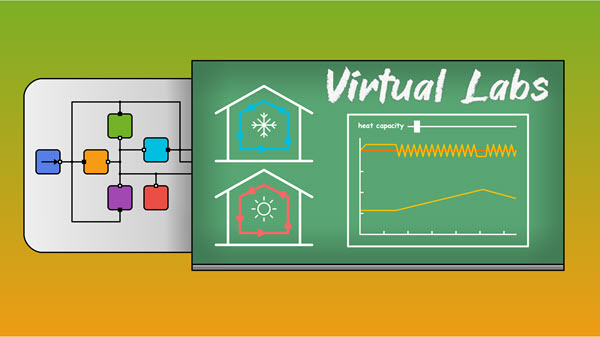

How can you make teaching come alive and be more engaging? For many educators, the answer turns out to be not so much a single solution, but rather a set of tools that can vary according to subject and even by student. Wolfram has now added a new tool to the pedagogical toolkit: [Wolfram Virtual Labs](https://www.wolfram.com/system-modeler/libraries/).

These are:

- *Open education resources (OER).*
- *Designed to encourage student curiosity by allowing students to test ideas with immediate feedback in a programmatic environment.*
- *Created to make memorization easier.*

The following Virtual Labs libraries are now available for download from the [SystemModeler library store](https://www.wolfram.com/system-modeler/libraries/):

- *[CollegeThermal](https://www.wolfram.com/system-modeler/libraries/college-thermal/): Developed in collaboration with [Politecnico di Torino](https://www.polito.it/?lang=en). Contains interactive thermal labs related to heat transfer and thermal engineering courses.*
- *[HighSchoolBiology](https://www.wolfram.com/system-modeler/libraries/high-school-biology/): Developed in collaboration with [Linköping University](https://liu.se/) and [VicSTEM](https://www.education.vic.gov.au/about/programs/learningdev/vicstem/Pages/wolframsoftware.aspx). Contains interactive biology labs related to cell transport phenomena, population models and food metabolism.*
- *[HighSchoolChemistry](https://www.wolfram.com/system-modeler/libraries/high-school-chemistry/): Developed in collaboration with [Linköping University](https://liu.se/). Contains interactive chemistry labs related to rate laws, homogenous reactions and heterogenous reactions.*

Stay tuned for upcoming libraries, including:

- *HighSchoolPhysics*
- *CollegeElectricalAnalog*
- *CollegeMechanicalEngineering*

The labs are developed using Mathematica notebooks with Modelica models running in the background. For more information, please read the [CollegeThermal release blog](https://blog.wolfram.com/2019/10/08/powering-engineering-education-with-wolfram-virtual-labs/).

[Click here](https://www.wolfram.com/system-modeler/what-is-new/) to read the latest SystemModeler news.
